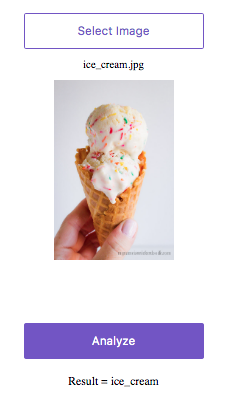
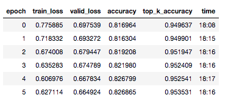

## Objectives: 
Classify images of food into different classes (101) using Deep Learning.

Live demo: http://food101.onrender.com

## Challenge:
Multi-Class Image Classification

## Library/Language:
1. Python
2. Deep Learning: Fast.AI, PyTorch

## Data:
https://www.vision.ee.ethz.ch/datasets_extra/food-101/

We introduce a challenging data set of 101 food categories, with 101'000 images. For each class, 250 manually reviewed test images are provided as well as 750 training images. On purpose, the training images were not cleaned, and thus still contain some amount of noise. This comes mostly in the form of intense colors and sometimes wrong labels. All images were rescaled to have a maximum side length of 512 pixels.

## Result:    

## Future Work:
- Test Time Augmentations (TTA) 
- Use USDA API to retrieve nutritional information  |  <a href="https://ndb.nal.usda.gov/ndb/doc/index">USDA Food Composition Databases</a>
- Extend mobile capabilitiese + live objective detection

